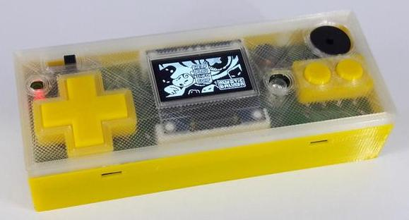

# Hardware for the BG-Boy

The BG-Boy was designed as part of a course at the [Bismarck Gymnasium
in Karlsruhe, Germany](http://bismarck-gymnasium.de/). The intention
was to show children in a hands-on approach all steps from the basic
project idea to a working prototype using a custom designed PCB and a
3D printed case. The entire project was meant to be simple enough to
be assembled by fifth grade kids and cheap enough to give each kid a
free device.

The resulting device ran on a single 1,5 V AA cell and was compatible
with the [Arduino2/Slimboy](https://github.com/harbaum/Arduboy2) project.

Hardware designs for the BG-Boy:

- [Custom BG-Boy printed circuit board](board)
- [BG-Boy case design](case)
