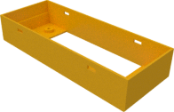
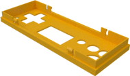
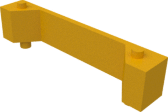
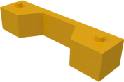
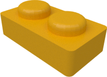
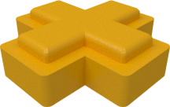

# Slimboy case

## Top and bottom case halves

|  |  |
|:---:|:---:|
| [View `bottom.stl`](bottom.stl) | [View `top.stl`](top.stl) |
| [Download `bottom.stl`](bottom.stl?raw=true) | [Download `top.stl`](top.stl?raw=true) |

## Display rest to support the display when mounted on the pcb

|  |  |
|:---:|:---:|
| [View `display_rest_bottom.stl`](display_rest_bottom.stl) | [View `display_rest_top.stl`](display_rest_top.stl) |
| [Download `display_rest_bottom.stl`](display_rest_bottom.stl?raw=true) | [Download `display_rest_top.stl`](display_rest_top.stl?raw=true) |

## Fire and direction buttons

|  |  |
|:---:|:---:|
| [View `buttons_fire.stl`](buttons_fire.stl) | [View `buttons_dir.stl`](buttons_dir.stl) |
| [Download `buttons_fire.stl`](buttons_fire.stl?raw=true) | [Download `buttons_dir.stl`](buttons_dir.stl?raw=true) |
